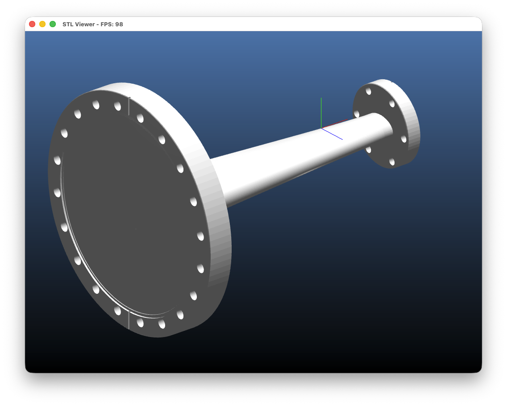

# mySTLViewer

A modern OpenGL-based STL file viewer built with CMake, vcpkg, SDL3, and OpenGL 3.3+.



## Features

- **STL File Support**: Reads both ASCII and binary STL files
- **Modern OpenGL**: Uses OpenGL 3.3+ with programmable shaders
- **Dual Render Modes**: Switch between solid and wireframe rendering
- **Orthogonal Projection**: Clean orthographic view of 3D models
- **Interactive Controls**: Mouse-based rotation, pan, zoom, and custom rotation pivot
- **Startup File Dialog**: Native file chooser on launch (argument optional)
- **Cross-platform**: Built with CMake and vcpkg for easy portability

## Prerequisites

- CMake 3.20 or higher
- vcpkg package manager
- C++17 compatible compiler
- Git

## Building the Project

### 1. Install vcpkg (if not already installed)

```bash
git clone https://github.com/Microsoft/vcpkg.git
cd vcpkg
./bootstrap-vcpkg.sh  # On macOS/Linux
# ./bootstrap-vcpkg.bat  # On Windows
```

### 2. Set vcpkg environment variable (optional but recommended)

```bash
export VCPKG_ROOT=/path/to/vcpkg
```

### 3. Build the project

```bash
# From the project root directory
mkdir build
cd build

# Configure with CMake (specify vcpkg toolchain)
cmake .. -DCMAKE_TOOLCHAIN_FILE=$VCPKG_ROOT/scripts/buildsystems/vcpkg.cmake

# Or if you didn't set VCPKG_ROOT:
cmake .. -DCMAKE_TOOLCHAIN_FILE=/path/to/vcpkg/scripts/buildsystems/vcpkg.cmake

# Build
cmake --build .
```

### 4. Run the application

```bash
./mySTLViewer
```

On startup, a native file dialog will prompt you to select an STL file. You can also pass a file path as a command-line argument to skip the dialog.

## Usage

### Command Line

```bash
mySTLViewer [stl_file]
```

- If `[stl_file]` is provided, the viewer opens it directly.
- If omitted, a native file dialog appears to select an STL file.

### Controls

- **Right Mouse Button + Drag**: Rotate the model
- **Left Mouse Button (click)**: Pick a rotation pivot (closest vertex under cursor); axes appear at the pivot
- **Middle Mouse Button + Drag**: Pan the view
- **Mouse Wheel**: Zoom in/out

#### Trackpad Alternatives
- **Z + Left Mouse Drag**: Zoom in/out (alternative to mouse wheel)
- **D + Left Mouse Drag**: Pan the view (alternative to middle mouse)

#### Other Controls
- **K**: Toggle kinetic rotate/zoom (inertia; pan is not affected)
- **Ctrl/Cmd + O**: Open file dialog (Load)
- **Ctrl/Cmd + Q**: Quit application
- **M**: Toggle OpenMP-based pivot picking (if enabled in the build)
- **W**: Switch to wireframe mode
- **S**: Switch to solid mode
- **V**: Toggle VSync
- **R**: Reset view to default position and clear custom pivot
- **Q** or **ESC**: Quit application

#### Custom Pivot Notes
#### Kinetic Controls
- Disabled by default; toggle with the K key.
- Rotation inertia continues after you release the right mouse button, based on your last drag velocity.
- Zoom inertia continues briefly after a mouse wheel scroll.
- Panning is never affected by kinetic motion.

- When a pivot is selected, rotations occur around that point; otherwise the model rotates around its center.
- If you click far from the model (more than ~100 px from any vertex), pivot mode is disabled automatically.
- Selecting a pivot does not shift the view; the chosen point stays under the cursor.

## Project Structure

```
mySTLViewer/
├── CMakeLists.txt          # CMake build configuration
├── vcpkg.json              # vcpkg dependencies
├── README.md               # This file
├── src/
│   ├── main.cpp            # Application entry point and SDL3 setup
│   ├── STLLoader.h/.cpp    # STL file parser (binary & ASCII)
│   ├── Renderer.h/.cpp     # OpenGL rendering engine
│   └── Mesh.h              # Mesh data structure
└── shaders/
    ├── vertex.glsl         # Vertex shader
    └── fragment.glsl       # Fragment shader with lighting
```

## Dependencies

The project uses the following libraries managed by vcpkg:

- **SDL3**: Window management and input handling
- **glad**: OpenGL function loader
- **glm**: OpenGL Mathematics library for matrix operations
- **nativefiledialog-extended (nfd)**: Native file open dialog on all platforms
- **OpenMP (optional)**: Speeds up pivot picking by parallelizing the nearest-vertex search
    - On macOS with AppleClang, install `libomp` via Homebrew; the build auto-detects and links it.

## Technical Details

### STL File Format Support

- **Binary STL**: Fast loading, compact file size
- **ASCII STL**: Human-readable format
- Auto-detection of file format

### Rendering Features

- Orthogonal projection for accurate size representation
- Phong-like lighting with ambient and diffuse components
- Edge highlighting for better depth perception
- Automatic model centering and scaling
- Back-face culling for performance

### OpenGL Features

- Modern OpenGL 3.3 Core Profile (required)
- Vertex Array Objects (VAO)
- Vertex Buffer Objects (VBO)
- Element Buffer Objects (EBO)
- GLSL Shaders (version 330)

## Troubleshooting

### vcpkg package installation fails

Make sure vcpkg is up to date:
```bash
cd $VCPKG_ROOT
git pull
./bootstrap-vcpkg.sh
```

### OpenGL version errors

Ensure your graphics drivers are up to date and support OpenGL 3.3 or higher. The application checks and exits early if the runtime OpenGL version is below 3.3.

### Shader compilation errors

Check that the `shaders/` directory is copied to your build directory. CMake should handle this automatically.

### Enable OpenMP (parallel pivot picking) on macOS

AppleClang doesn’t ship OpenMP by default. This project can enable OpenMP via Homebrew’s `libomp` on Apple Silicon:

1) Install libomp
```bash
brew install libomp
```

2) Configure the project (from the `build/` dir)
```bash
cmake .. -DCMAKE_TOOLCHAIN_FILE=$VCPKG_ROOT/scripts/buildsystems/vcpkg.cmake
```

The build will try the standard OpenMP detection first. If that fails on macOS, it will fall back to Homebrew’s libomp at `/opt/homebrew/opt/libomp` automatically and define `HAVE_OPENMP`.

If your Homebrew prefix is different, set it explicitly:
```bash
cmake .. -DHOMEBREW_LIBOMP_PREFIX=/custom/prefix/opt/libomp \
         -DCMAKE_TOOLCHAIN_FILE=$VCPKG_ROOT/scripts/buildsystems/vcpkg.cmake
```

3) At runtime, press `M` to toggle OpenMP-based picking on/off.

## License

This project is provided as-is for educational and personal use.

## Future Enhancements

Potential features for future development:

- Support for multiple file formats (OBJ, PLY)
- Model measurements and analysis tools
- Material/color customization
- Screenshot/export functionality
- Model slicing preview
- Performance optimizations for large models
